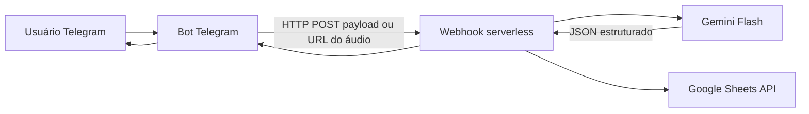

# Ringo

Sistema pessoal para **capturar lançamentos financeiros por áudio ou texto** (Telegram) e **gravar automaticamente** em uma **Google Planilhas** já modelada para finanças pessoais. O processamento usa **Google Gemini** (prioridade: **Gemini Flash** com suporte a entrada multimodal, incluindo áudio).

Repositório único (**monorepo**): bot no Telegram e serviço webhook compartilham tipos, contratos de API e documentação — adequado para uso leve e free tier. Se no futuro o bot precisar escalar separado do processamento, pode-se extrair um segundo repositório; para começar, um repo reduz atrito e custos de CI/deploy.

Board de planejamento: [ringo no Trello](https://trello.com/b/quQF4X0L/ringo).

## Visão da arquitetura



- **Bot Telegram**: única responsabilidade exposta ao usuário — receber mensagens de **voz/áudio** e **texto**, encaminhar ao webhook (com autenticação), responder com confirmação e, opcionalmente, o **resumo do lançamento** retornado pela LLM.
- **Webhook**: endpoint HTTP que pode **hibernar** após ~15 minutos sem tráfego (comportamento típico de free tier). Ao acordar, descarrega o áudio apenas de `api.telegram.org` quando necessário, chama o Gemini para extrair JSON canônico de lançamento e **append** na planilha quando integrado (ainda pendente).

Detalhes de contrato e limites estão em [`docs/context/ringo-system.md`](docs/context/ringo-system.md) (contexto do sistema para documentação e RAG).

## Requisitos funcionais (resumo)

| Entrada | Saída esperada |
|--------|-----------------|
| Áudio (voz) | Confirmação de lançamento; opcionalmente string com dados parseados (categoria, valor, data, observação, etc.). |
| Texto | Mesmo fluxo: confirmação + resumo parseado quando fizer sentido. |

## Stack sugerida (free tier / uso leve)

Valores e limites mudam; sempre confira os sites oficiais antes de fixar produção.

| Componente | Sugestão | Notas |
|------------|----------|--------|
| LLM | [Gemini API](https://ai.google.dev/) — modelo **Flash** | Multimodal; adequado para áudio + extração estruturada em JSON. |
| Hospedagem webhook | Plataforma com scale-to-zero (ex.: Cloud Run free tier, Render, Fly.io, ou similar) | Cold start após idle é esperado; manter handler idempotente e timeouts compatíveis. |
| Planilha | Google Sheets + Service Account ou OAuth | Cota da API Sheets para uso pessoal costuma ser suficiente para poucos lançamentos/dia. |
| Bot | Long-polling ou webhook do Telegram em processo leve | Bot pode rodar no mesmo serviço que o webhook **ou** em job gratuito separado, conforme limites da plataforma. |

## Configuração

1. Copie [`env.example`](env.example) para `.env` na **raiz** do repositório (`cp env.example .env`).
2. Preencha `WEBHOOK_SHARED_SECRET` (o bot deve enviar `Authorization: Bearer <mesmo valor>` em `POST /ingest`).
3. Preencha `GEMINI_API_KEY` para o webhook chamar o **Gemini Flash** em `POST /ingest` e devolver `lancamento` validado. Sem a chave, `/ingest` responde **503** com `erro.codigo` `misconfigured_gemini`. Opcional: **`GEMINI_MODEL`** (omissão `gemini-2.5-flash`; em erro de modelo testa `gemini-2.0-flash`).
4. Variáveis `GOOGLE_SHEETS_SPREADSHEET_ID`, `GOOGLE_APPLICATION_CREDENTIALS`, etc. entram em uso quando o **append** à planilha estiver integrado (a Sheet ainda não é escrita nesta versão).

Detalhes do contrato HTTP e do corpo JSON estão em [`docs/context/ringo-system.md`](docs/context/ringo-system.md).

## Estrutura do repositório

```
ringo/
  package.json              # npm workspaces
  env.example               # variáveis documentadas → copiar para .env
  tsconfig.base.json
  apps/
    webhook/
      src/
        app.ts             # Express: rotas e ordem dos middlewares
        server.ts          # listen
        middleware/
        controllers/
        services/
        repositories/
  packages/
    shared/                 # @ringo/shared — tipos + ingestRequestSchema + lancamentoFinanceiroSchema (Zod)
  docs/
    context/
      ringo-system.md
  postman/
    Ringo-Webhook.postman_collection.json
  .cursor/rules/
```

## Postman

Importe [`postman/Ringo-Webhook.postman_collection.json`](postman/Ringo-Webhook.postman_collection.json) no Postman. Na collection, defina `baseUrl` (ex.: `http://localhost:3000`) e `webhookSecret` igual a `WEBHOOK_SHARED_SECRET` do `.env`.

## Desenvolvimento local (webhook)

Requisitos: **Node.js 20+**.

```bash
npm install
cp env.example .env
# Edite .env: WEBHOOK_SHARED_SECRET e GEMINI_API_KEY

npm run dev:webhook
```

- O webhook carrega `.env` da **raiz do monorepo** (ao lado de `package.json` das workspaces), mesmo quando o comando corre em `apps/webhook`.
- Stack: **Express** (`apps/webhook`), validação do corpo com **Zod** no `@ringo/shared` (`ingestRequestSchema`; resposta da LLM validada com `lancamentoFinanceiroSchema`).
- Saúde: [http://localhost:3000/health](http://localhost:3000/health) (porta padrão `3000`; sobrescreva com `PORT` no `.env`).
- Ingestão: `POST …/ingest` autenticado. Com `GEMINI_API_KEY` definido, o webhook chama o Gemini Flash: **200** com `ok: true` e `lancamento` em caso de sucesso; **200** com `ok: false` para falhas tratadas (`invalid_audio_url`, `gemini_auth`, `gemini_model_not_found`, `gemini_rate_limit`, `gemini_unavailable`, `extraction_invalid`, etc.); **503** se `GEMINI_API_KEY` estiver ausente. Gravar na **Google Sheet** ainda não está implementado — a mensagem ao utilizador indica que a planilha está pendente.

Verificação de tipos do app webhook:

```bash
npm run typecheck -w @ringo/webhook
```

## Contribuir / desenvolver

1. Ler `docs/context/ringo-system.md` e as regras em `.cursor/rules/`.
2. Manter o contrato JSON de lançamento e o mapeamento para colunas da planilha documentados quando mudarem.
3. Priorizar soluções compatíveis com **custo zero ou baixo** e **cold start** aceitável.

## Licença

Definir conforme preferência do autor (projeto pessoal).
